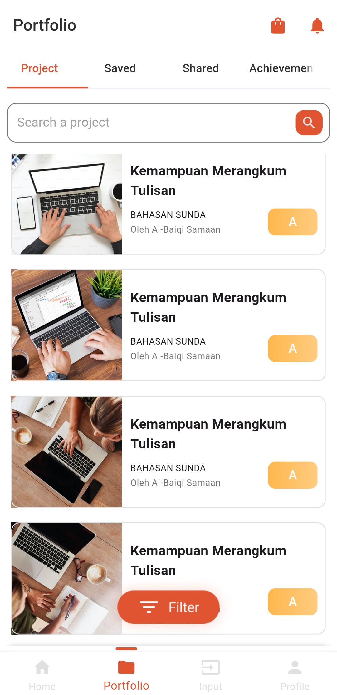

# Yoliday_portfolio_assignment

# Overview

This project is an assignment for the Flutter internship interview. The task involves to design a Porfolio Page consists of Projects data which is static.

# Task Details

1. Create the page provided in design.
2. Use flutter_screen_utils package for
   Responsive fonts and spacing.
3. Use the colors provided in the design for
   fonts and other things.
4. Make the app look as close to the 
   design as possible.
5. The portfolio page should be scrollable.
6. The Filter button is just for appearance,
   it doesn't have to work.
7. Use static data for the cards.
8. The bottom nav bar should also match 
   the Figma design.
9. Whenever we click on icon in button 
   nav bar that icon and label should change
   their color to orange like color in Figma
   design, and the indicator should move above
   that icon.
10. The tabs: home,input and profile should
    contain empty scaffold or container.
11. The tabs ‘saved’,’shared’ and
   ‘Achievement’ should contain empty
    containers.
12. Take all the svg icons from the figma 
    design.
13. Writing in search bar should filter the card
    shown based on their title text.
14. Don't use google fonts, use the fonts by
    downloading them in assets folder.

# ScreenShots

  <h3>Portfolio Page Screenshot</h3>
  

# Installation
1. Clone the Repository:
   git clone https://github.com/your-username/     yoliday_porfolio_assignment.git 
   cd yoliday_portfolio_assignment

2. Install Dependencies: Ensure Flutter is installed,then fetch project dependencies:
   flutter pub get

3. Run the App:
   flutter run

# Directory Structure

- lib/
  - main.dart
  - screens/
    - home.dart
    - input.dart
    - profile.dart
    - saved.dart
    - shared.dart
    - achievement.dart
  - widgets/
    - bottom_nav_bar.dart
    - card_list.dart
    - search_bar.dart
- assets/
  - fonts/
    - CustomFont-Regular.ttf
    - CustomFont-Bold.ttf
  - icons/
    - home.svg
    - input.svg
    - profile.svg
    - saved.svg
    - shared.svg
    - achievement.svg
- screenshots/
  - portfolio_page.png
  - bottom_nav.png
  - search_filter.png
- pubspec.yaml

# Future Improvements

Filter Button: Implement logic to dynamically filter portfolio cards based on various criteria.

Tab Functionality: Add relevant content and widgets in the empty tabs for a fully functional app.

Dynamic Data: Integrate API calls to display live portfolio data instead of static data.

# License
This project is licensed under the MIT License - see the LICENSE file for details.